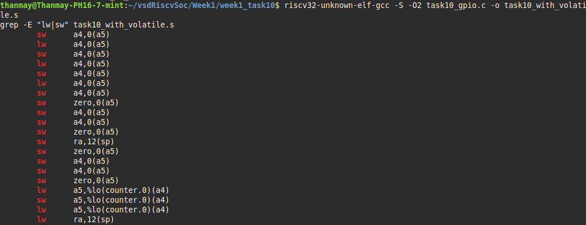
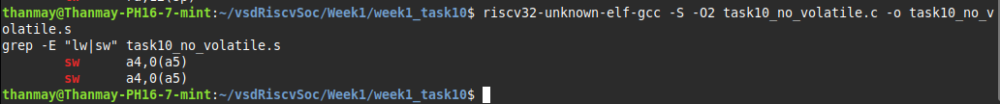

# 🔌 Task 10: Memory-Mapped I/O – GPIO Toggle with `volatile`

🎯 **Objective**  
Demonstrate how to toggle a memory-mapped GPIO register at `0x10012000` in bare-metal C for RISC-V, and explain how the `volatile` keyword prevents compiler optimization from eliminating critical memory accesses.

---

## 🧱 Implementation Overview

### ✅ GPIO Register Used:
```c
#define GPIO_ADDR 0x10012000
```

### ✅ Volatile Access:
```c
volatile uint32_t *gpio = (volatile uint32_t *)GPIO_ADDR;
*gpio = 0x1; // Write HIGH
*gpio = 0x0; // Write LOW
```

### 🚫 Non-Volatile Access (Risk of Optimization):
```c
uint32_t *gpio = (uint32_t *)GPIO_ADDR;
*gpio = 0x1;
*gpio = 0x0;
```

---

## 🛠️ Step-by-Step Process

### Step 1: Write Two Programs

- `task10_gpio.c` → With `volatile`
- `task10_no_volatile.c` → Without `volatile`

### Step 2: Compile Both Versions

```bash
riscv32-unknown-elf-gcc -S -O2 task10_gpio.c -o task10_with_volatile.s
riscv32-unknown-elf-gcc -S -O2 task10_no_volatile.c -o task10_no_volatile.s
```

### Step 3: Analyze the Assembly

- ✅ With `volatile`: Multiple `lw` and `sw` operations visible.
- ❌ Without `volatile`: Almost no memory operations.

### Screenshot 📸
📌 Paste your screenshot below showing terminal output with the following commands:
```
grep -E "lw|sw" task10_with_volatile.s
grep -E "lw|sw" task10_no_volatile.s
```

---

## 🧪 Observations

| Version              | Memory Ops (`lw`/`sw`) | Optimized Out |
|----------------------|------------------------|----------------|
| ✅ With `volatile`    | ✅ Preserved all        | ❌ No          |
| ❌ Without `volatile` | ⚠️ Mostly eliminated     | ✅ Yes         |

---

## 📚 Explanation

### ✅ Why `volatile`?

| Concept     | Description |
|-------------|-------------|
| `volatile`  | Prevents compiler from optimizing away memory access |
| Memory-Mapped I/O | Access to hardware registers mapped to fixed addresses |
| Alignment   | `uint32_t` requires 4-byte alignment (0x10012000 is safe) |
| Safety      | Essential for real-time hardware interaction |

### 🔧 Key Insight

> When dealing with hardware, **what looks redundant to the compiler might be essential**. `volatile` tells the compiler: “Trust me, this memory write matters.”

---

## ✅ Success Criteria

- [x] GPIO toggling implemented with `volatile`
- [x] ELF compiled successfully
- [x] Assembly file analyzed
- [x] `volatile` prevents compiler optimization
- [x] Alignment explained (0x10012000 is 4-byte aligned)

---

## 📸 Paste Screenshots Below

### ✅ With Volatile


### ❌ Without Volatile


---

## 🎉 You’ve Completed Task 10!
