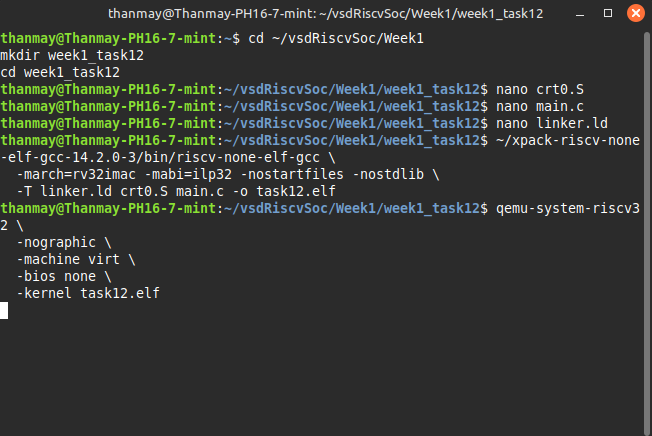

# 🧠 Week 1 - Task 12: Start-up Code & crt0

## 🎯 Objective
Understand what `crt0.S` (C runtime startup code) does in a bare-metal RISC-V program.

---

## 🛠️ What is `crt0.S`?
The `crt0.S` file is the _startup code_ that:
- Sets up the stack pointer
- Zeroes out the `.bss` section
- Calls `main()`
- Enters an infinite loop if `main` returns

This code is **crucial** for running a C program on bare-metal hardware, where no OS is present.

---

## 📁 Project Structure

```
week1_task12/
├── crt0.S         # Assembly startup file
├── main.c         # Simple main function
├── linker.ld      # Linker script
└── task12.elf     # Final compiled ELF file
```

---

## 🔧 Step-by-Step Instructions

### ✅ Step 1: Create `crt0.S`
```assembly
.section .text
.global _start
_start:
    la sp, _stack_top        # Set stack pointer

    # Zero the .bss section
    la a0, __bss_start
    la a1, __bss_end
bss_loop:
    bge a0, a1, call_main
    sw zero, 0(a0)
    addi a0, a0, 4
    j bss_loop

call_main:
    call main

hang:
    wfi
    j hang
```

### ✅ Step 2: Create `main.c`
```c
int main() {
    volatile int counter = 0;
    counter++;
    return 0;
}
```

### ✅ Step 3: Create `linker.ld`
```ld
ENTRY(_start)

MEMORY {
  FLASH (rx) : ORIGIN = 0x00000000, LENGTH = 128K
  RAM (rw)   : ORIGIN = 0x10000000, LENGTH = 128K
}

SECTIONS {
  .text : {
    *(.text*)
  } > FLASH

  .data : {
    *(.data*)
  } > RAM

  .bss : {
    __bss_start = .;
    *(.bss*)
    *(COMMON)
    __bss_end = .;
  } > RAM
}
```

### ✅ Step 4: Compile
```bash
riscv-none-elf-gcc -march=rv32imac -mabi=ilp32 -nostdlib -nostartfiles   -T linker.ld crt0.S main.c -o task12.elf
```

### ✅ Step 5: Run on QEMU
```bash
qemu-system-riscv32 -nographic -machine virt -bios none -kernel task12.elf
```
➡️ You won’t see output because `main()` just increments a counter and returns. Execution halts in an infinite loop.

---

## 📸 Screenshots To Attach


---

## 📘 What We Learned
- Startup code is essential in bare-metal programs
- `crt0.S` handles early runtime init like stack and `.bss`
- No standard libraries or OS are needed when bootstrapping from scratch
- You can control exactly what happens before `main()` is invoked

---

🎉 **Task 12 Complete!**
