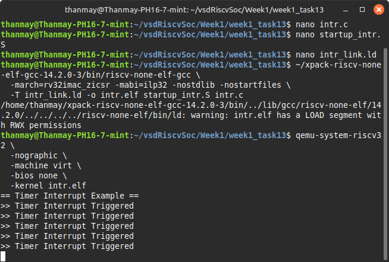

# 🧠 Week 1 - Task 13: Interrupt Primer

## 🎯 Objective

Demonstrate how to enable the Machine-Timer Interrupt (MTIP) in a bare-metal RISC-V environment using C and assembly. Understand how the `mtime` and `mtimecmp` registers are used in timer-based interrupt generation.

---

## ⚙️ How It Works

### What is MTIP?

- **mtime**: A 64-bit memory-mapped counter that increments continuously.
- **mtimecmp**: A 64-bit register. When `mtime >= mtimecmp`, MTIP is triggered.
- The processor jumps to the handler at `mtvec` when the interrupt occurs.

### Process Flow

1. **Set up trap handler** at `mtvec`.
2. **Initialize `mtimecmp`** to `mtime + DELAY`.
3. **Enable interrupts** using CSR instructions (`mie`, `mstatus`).
4. **Wait in a loop** with `wfi` until interrupts are triggered.
5. **Interrupts** occur 5 times. ISR increments a counter and re-triggers timer.

---

## 📂 Files

### `intr.c`

Implements:
- UART print
- Timer ISR (`timer_isr()`)
- Global interrupt config

### `startup_intr.S`

Sets up:
- Stack pointer
- Trap handler with context save/restore
- Infinite loop via `wfi`

### `intr_link.ld`

Linker script:
- Places `.text`, `.data`, `.rodata`, `.trap`, `.bss` appropriately
- Declares `_stack_top`

---

## 🧪 Commands Used

```bash
# Compile
riscv32-unknown-elf-gcc -march=rv32imac_zicsr -mabi=ilp32 -nostdlib -nostartfiles \
  -T intr_link.ld -o intr.elf startup_intr.S intr.c

# Run on QEMU
qemu-system-riscv32 -machine virt -nographic -bios none -kernel intr.elf
```

---

## ✅ Expected Output

```
== Timer Interrupt Example ==
>> Timer Interrupt Triggered
>> Timer Interrupt Triggered
>> Timer Interrupt Triggered
>> Timer Interrupt Triggered
>> Timer Interrupt Triggered
```

---

## 🧠 Key Takeaways

- **MTIP setup** relies on CLINT registers.
- **CSR config**: `mtvec`, `mie`, `mstatus` must be correctly configured.
- **Trap handler** saves/loads context and uses `mret`.
- **Volatile**: Prevents compiler from removing I/O memory operations.
- **wfi**: Efficient low-power wait until the next interrupt.

---

## 📸 Attach Screenshot



---

