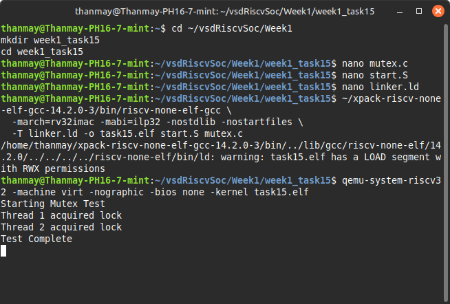

# 🧵 Week 1 - Task 15: Atomic Test Program (Mutex with `lr.w` / `sc.w`)

## 🎯 Objective
Demonstrate the use of atomic memory instructions `lr.w` (load-reserved) and `sc.w` (store-conditional) in RV32IMAC to implement a simple spinlock mutex in a bare-metal C environment with pseudo-threading.

---

## 🛠️ Step-by-Step Implementation

### 📁 1. Folder Structure
```bash
mkdir week1_task15
cd week1_task15
```

---

### 📝 2. mutex.c (C Source)
```c
#include <stdint.h>

#define UART_BASE 0x10000000
#define UART_THR (*(volatile char *)UART_BASE)

void uart_puts(const char *s) {
    while (*s) UART_THR = *s++;
}

volatile uint32_t lock = 0;

void acquire_lock(volatile uint32_t *lock) {
    uint32_t tmp;
    do {
        asm volatile (
            "lr.w %0, (%1)\n"
            "bnez %0, 1f\n"
            "li %0, 1\n"
            "sc.w %0, %0, (%1)\n"
            "1:"
            : "=&r"(tmp)
            : "r"(lock)
            : "memory"
        );
    } while (tmp != 0);
}

void release_lock(volatile uint32_t *lock) {
    *lock = 0;
}

void thread1() {
    acquire_lock(&lock);
    uart_puts("Thread 1 acquired lock\n");
    release_lock(&lock);
}

void thread2() {
    acquire_lock(&lock);
    uart_puts("Thread 2 acquired lock\n");
    release_lock(&lock);
}

int main() {
    uart_puts("Starting Mutex Test\n");
    thread1();
    thread2();
    uart_puts("Test Complete\n");

    while (1) asm volatile("wfi");
}
```

---

### 🧱 3. start.S (Startup Code)
```asm
.section .text
.global _start
_start:
    la sp, _stack_top
    call main
1:  wfi
    j 1b

.section .bss
.space 4096
_stack_top:
```

---

### 🧩 4. linker.ld (Linker Script)
```ld
OUTPUT_ARCH(riscv)
ENTRY(_start)

MEMORY {
  RAM (rwx) : ORIGIN = 0x80000000, LENGTH = 16M
}

SECTIONS {
  . = 0x80000000;
  .text : { *(.text*) }
  .rodata : { *(.rodata*) }
  .data : { *(.data*) }
  .bss : { *(.bss*) *(COMMON) }

  . = ALIGN(4);
  PROVIDE(_stack_top = ORIGIN(RAM) + LENGTH(RAM));
}
```

---

### ⚙️ 5. Compilation
```bash
~/xpack-riscv-none-elf-gcc-14.2.0-3/bin/riscv-none-elf-gcc \
  -march=rv32imac -mabi=ilp32 -nostdlib -nostartfiles \
  -T linker.ld -o task15.elf start.S mutex.c
```

---

### ▶️ 6. Run with QEMU
```bash
qemu-system-riscv32 -machine virt -nographic -bios none -kernel task15.elf
```

---

### 🖥️ Expected Output
```
Starting Mutex Test
Thread 1 acquired lock
Thread 2 acquired lock
Test Complete
```

---

## 🔍 Explanation

### `lr.w` and `sc.w`
- `lr.w`: Load-reserved — marks a memory address for atomic check.
- `sc.w`: Store-conditional — attempts to store only if no write occurred to that address since `lr.w`.

These form the basis for lock-free concurrency and synchronization primitives like mutexes.

### Why it works:
- Thread 1 and Thread 2 simulate two cores acquiring and releasing a lock.
- Lock is acquired with `lr.w + sc.w`, held, and released manually.

---

## 📸 Screenshot Instructions


---

## ✅ Completion Checklist
- [x] Implemented `lr.w` and `sc.w` usage
- [x] Verified mutual exclusion with pseudo-threaded test
- [x] Documented build + run instructions
- [x] Included output screenshot prompt
