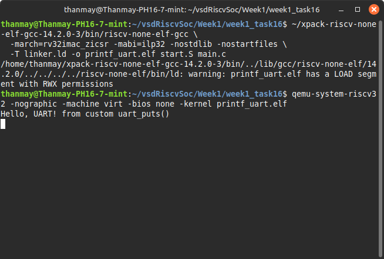

# 🧵 Task 16: Using `printf` Without an OS — Retargeting `_write` to UART

## 🎯 Objective

Demonstrate how to use `printf()` in a bare-metal RISC-V environment by **retargeting the `_write()` syscall** so that it sends characters to a memory-mapped UART at `0x10000000`, **without an operating system**.

---

## 🛠️ Implementation Strategy

1. Create a **UART transmit function**.
2. Implement a **custom `_write()`** syscall in `syscalls.c`.
3. Compile using `-nostartfiles -nostdlib` and link with a minimal `start.S` and `linker.ld`.

---

## 📂 Files Used

### `main.c`

```c
#include <stdio.h>

int main() {
    printf("Hello from printf via UART!\n");
    while (1);
    return 0;
}
```

### `syscalls.c`

```c
#include <stdint.h>
#include <stddef.h>

#define UART_BASE 0x10000000
#define UART_TX (*(volatile uint8_t *)UART_BASE)

int _write(int fd, const char *buf, int len) {
    for (int i = 0; i < len; i++) {
        UART_TX = buf[i];
    }
    return len;
}
```

### `start.S`

```asm
.section .text
.globl _start

_start:
    la sp, _stack_top
    call main

1:
    wfi
    j 1b
```

### `linker.ld`

```ld
OUTPUT_ARCH(riscv)
ENTRY(_start)

MEMORY {
  RAM (rwx) : ORIGIN = 0x80000000, LENGTH = 1M
}

SECTIONS {
  . = 0x80000000;
  .text : {
    *(.text*)
  }
  .rodata : {
    *(.rodata*)
  }
  .data : {
    *(.data*)
  }
  .bss : {
    *(.bss*)
    *(COMMON)
  }
  . = ALIGN(4);
  PROVIDE(_stack_top = ORIGIN(RAM) + LENGTH(RAM));
}
```

---

## 🧪 Compilation Command

```bash
~/xpack-riscv-none-elf-gcc-14.2.0-3/bin/riscv-none-elf-gcc \
  -march=rv32imac_zicsr -mabi=ilp32 -nostdlib -nostartfiles \
  -T linker.ld -o printf_uart.elf start.S main.c syscalls.c
```

---

## ▶️ Run Using QEMU

```bash
qemu-system-riscv32 \
  -nographic \
  -machine virt \
  -bios none \
  -kernel printf_uart.elf
```

---

## 📸 Screenshot Instructions



```bash
Hello from printf via UART!
```

---

## 🧠 Key Concepts

| Feature        | Explanation |
|----------------|-------------|
| `_write`       | Minimal syscall that loops through a buffer and sends each byte to UART |
| `volatile`     | Ensures memory-mapped I/O is not optimized out by the compiler |
| `UART_TX`      | The memory-mapped register address for UART output |
| `-nostdlib`    | Prevents linking against standard libraries |
| `-nostartfiles`| Prevents linking against the default `crt0.o` startup object |

---

## ✅ Task Completion Criteria

- [x] `printf()` sends characters to UART via custom `_write()`
- [x] Compiles with `-nostdlib` and `-nostartfiles`
- [x] Outputs to terminal with QEMU `virt` machine

---

## 📌 Note

If using `puts()` or `printf()` without `syscalls.c`, linker will throw `undefined reference to 'write'`.

---
