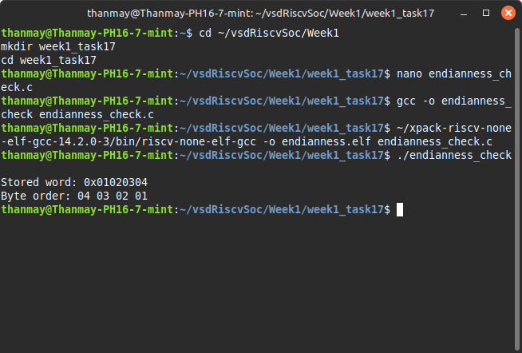

# Task 17: Endianness & Struct Packing

## 🌟 Objective

Demonstrate how to determine the byte ordering (endianness) of a system using a union trick in C. Confirm that RISC-V (RV32) is little-endian by default.

---

## 📊 Background

### What is Endianness?

- **Little-endian**: Least significant byte stored at the lowest address.
- **Big-endian**: Most significant byte stored at the lowest address.

RISC-V architecture is **little-endian** by default.

### Why It Matters

Understanding endianness is critical for:

- Cross-platform development
- Networking protocols
- Embedded system programming

---

## 📃 Methodology: Union Trick in C

We use a `union` of `uint32_t` and `uint8_t[4]` to observe byte-level memory layout.

```c
#include <stdio.h>
#include <stdint.h>

int main() {
    union {
        uint32_t word;
        uint8_t bytes[4];
    } test;

    test.word = 0x01020304;

    printf("Stored word: 0x%08X\n", test.word);
    printf("Byte order: %02X %02X %02X %02X\n",
           test.bytes[0], test.bytes[1], test.bytes[2], test.bytes[3]);

    return 0;
}
```

---

## 📚 Expected Output (Little-Endian)

```
Stored word: 0x01020304
Byte order: 04 03 02 01
```

This shows the **least significant byte (04)** is stored first ➔ **little-endian**.

---

## 💡 How to Run (Host Machine)

### Step-by-step Instructions

```bash
cd ~/vsdRiscvSoc/Week1
mkdir week1_task17
cd week1_task17

nano endianness_check.c  # Paste the union code here
gcc -o endianness_check endianness_check.c
./endianness_check
```

---

## 📷 Screenshot Instruction

Take a screenshot of this terminal command:

```bash
./endianness_check
```

Showing the stored word and byte order output.

---

## 📄 Summary

- RV32 is little-endian by default.
- This was verified using a C union trick.
- Useful for embedded systems, drivers, networking, and hardware-software interfacing.

---

## 🎨 Screenshot Placeholder



---


---

