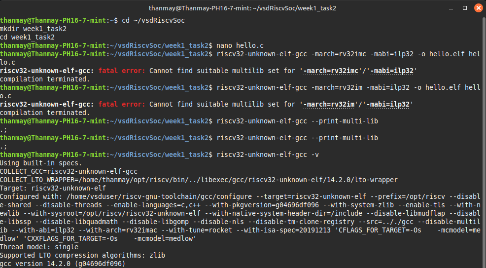
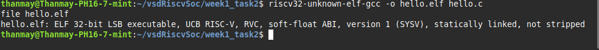

# Week 1 Task 2: Compile "Hello, RISC-V"

## 🌿 Objective

Create a minimal C "Hello World" program and successfully cross-compile it for the RISC-V RV32 architecture, producing a valid 32-bit RISC-V ELF executable that demonstrates proper toolchain functionality.

---

## 📄 Prerequisites

* ✅ RISC-V toolchain installed and configured ([Task 1 Completed](../week1_task1))
* ✅ `PATH` environment variable set to include `$HOME/opt/riscv/bin`
* ✅ Verified `riscv32-unknown-elf-gcc` is functional
* ✅ Basic understanding of C programming and cross-compilation concepts

---

## 🚀 Step-by-Step Implementation

### Step 1: Create the Hello World C Program

Create a minimal C program that demonstrates basic functionality and `printf` usage.

```bash
cd ~/vsdRiscvSoc
mkdir week1_task2
cd week1_task2
nano hello.c
```

#### hello.c

```c
#include <stdio.h>

int main() {
    printf("Hello, RISC-V!\n");
    return 0;
}
```

---

### Step 2: Cross-Compile for RISC-V Architecture

#### Initial Attempt (Caused Multilib Error)

```bash
riscv32-unknown-elf-gcc -march=rv32imc -mabi=ilp32 -o hello.elf hello.c
```

**Output:**

```
fatal error: Cannot find suitable multilib set for '-march=rv32imc'/'-mabi=ilp32'
```

#### Correct Compilation Command

```bash
riscv32-unknown-elf-gcc -o hello.elf hello.c
```

**✅ Success:** Compiled without errors.

---

### Step 3: Verify the Compiled ELF Binary

#### Check ELF Properties

```bash
file hello.elf
```

**Expected Output:**

```
hello.elf: ELF 32-bit LSB executable, UCB RISC-V, RVC, soft-float ABI, version 1 (SYSV), statically linked, not stripped
```

#### Additional Verifications

##### List ELF file

```bash
ls -la hello.elf
```

##### Confirm Target Architecture

```bash
riscv32-unknown-elf-gcc -dumpmachine
```

##### Check Toolchain Version

```bash
riscv32-unknown-elf-gcc -v
```

---

## 📊 Results Summary

* ✅ 32-bit RISC-V ELF executable generated successfully
* ✅ `file` command confirms target architecture and ABI
* ✅ Static linking and compressed instructions (RVC) enabled
* ✅ GCC 14.2.0 toolchain verified functional

---

## 🚧 Notes and Cautions

* **Avoid using explicit `-march` and `-mabi` flags unless you verify multilib support first:**

```bash
# This caused errors in this toolchain:
riscv32-unknown-elf-gcc -march=rv32imc -mabi=ilp32 -o hello.elf hello.c
```

* **Correct approach:** use the default toolchain configuration unless specific ISA tuning is required.

---

## 📷 Screenshot Evidence

| Multilib Error Encountered                              | Successful Compilation                                          |
| ------------------------------------------------------- | --------------------------------------------------------------- |
|  |  |

---

## 🎉 Conclusion

Successfully completed Task 2 by cross-compiling a minimal C "Hello World" program for RISC-V. Verified toolchain functionality and produced a valid ELF binary ready for the next task.

Ready to proceed to **Task 3: Analyze the RISC-V Assembly Output**.

---

