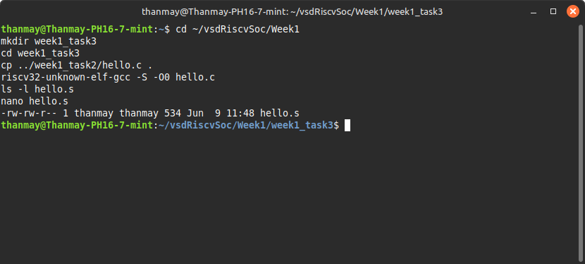
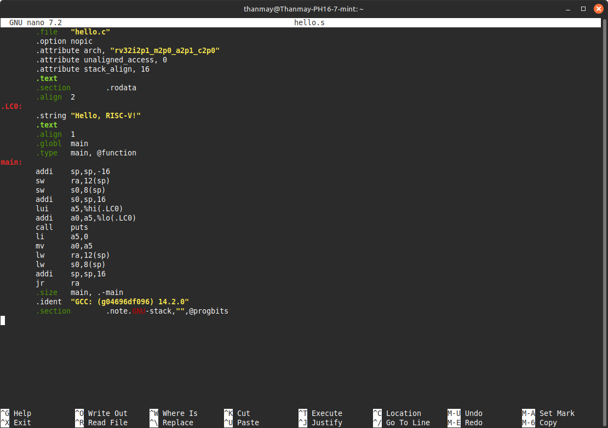

# 🛠️ Week 1 - Task 3: From C to Assembly

## 🎯 Objective  
Generate the assembly `.s` file from a minimal C program and understand the **prologue** and **epilogue** of the `main` function in RISC-V assembly.

---

## 🚀 Step-by-Step Implementation

### Step 1: Generate the Assembly File  
Use the RISC-V cross compiler to generate the assembly code from your C source.

```bash
riscv32-unknown-elf-gcc -S -O0 hello.c
```
This command creates a `hello.s` file containing the assembly instructions corresponding to `hello.c`.

The `-S` flag tells GCC to compile to assembly only (no linking).

The `-O0` flag disables optimizations for easier reading.

### Step 2: Examine the Assembly Code
Open the generated `hello.s` file to review the assembly instructions:

```assembly
main:
    addi    sp, sp, -16       # Allocate stack space (prologue)
    sw      ra, 12(sp)        # Save return address
    sw      s0, 8(sp)         # Save frame pointer
    addi    s0, sp, 16        # Set frame pointer

    lui     a5, %hi(.LC0)     # Load address of string "Hello, RISC-V!"
    addi    a0, a5, %lo(.LC0)
    call    puts              # Call puts to print string

    li      a5, 0             # Prepare return value 0
    mv      a0, a5

    lw      ra, 12(sp)        # Restore return address (epilogue)
    lw      s0, 8(sp)         # Restore frame pointer
    addi    sp, sp, 16        # Deallocate stack space
    jr      ra                # Return from main
```

### 🔍 Explanation: Prologue and Epilogue
**Prologue:**

- `addi sp, sp, -16` reserves stack space for the function.
- `sw ra, 12(sp)` and `sw s0, 8(sp)` save the return address and frame pointer so they can be restored later.
- `addi s0, sp, 16` sets the new frame pointer.

**Epilogue:**

- Restores saved registers with `lw ra, 12(sp)` and `lw s0, 8(sp)`.
- Frees stack space with `addi sp, sp, 16`.
- Returns control to the caller via `jr ra`.

---

## ✅ Verification
View the assembly file content with:

```bash
cat hello.s
```
Or open it with an editor like `nano` or `vim`.

---

## 📸 Screenshots

Terminal showing the command execution for generating assembly:



The `hello.s` file opened in editor:




---

## 📝 Summary
This task demonstrated how to generate and read assembly code from C source using the RISC-V toolchain. Understanding the prologue and epilogue helps grasp how function calls manage the stack and registers in assembly.

