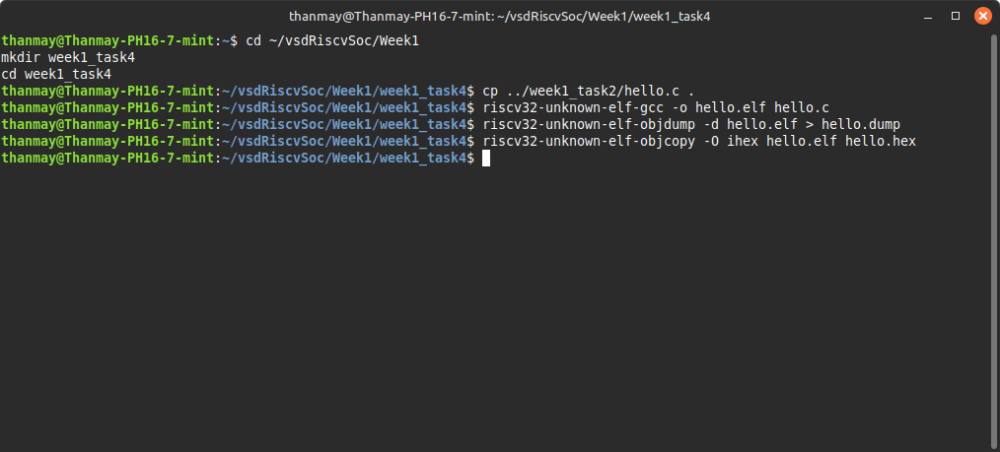
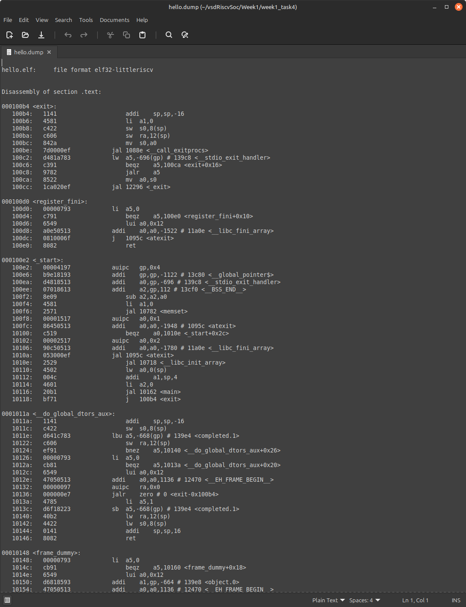
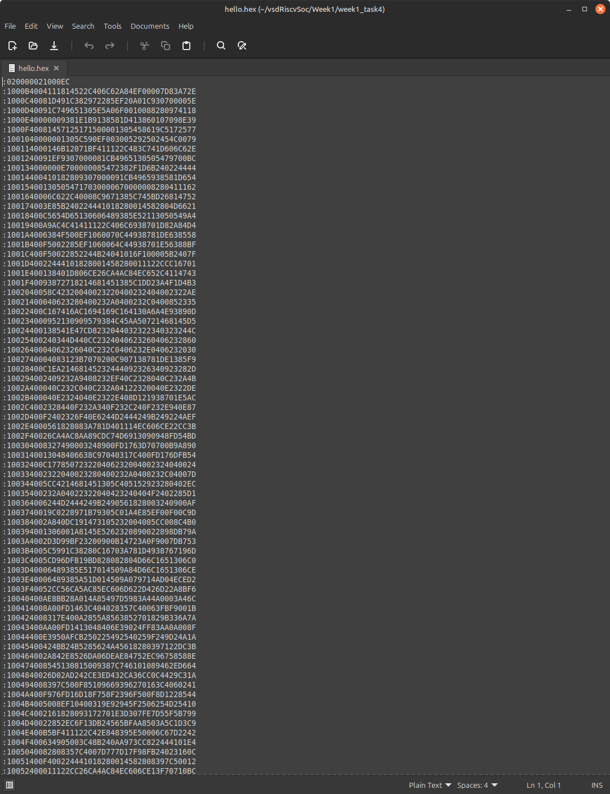

# 🏗️ Week 1 - Task 4: Hex Dump & Disassembly

## 🎯 Objective

Learn how to turn an ELF binary into a raw hex dump and a disassembled listing using `objdump` and `objcopy`.  
Understand what each column in the disassembly output means.

---

## 📋 Prerequisites

✅ Completed Task 3 (have a valid `hello.elf` binary)  
✅ RISC-V toolchain installed and configured  
✅ `riscv32-unknown-elf-objdump` and `riscv32-unknown-elf-objcopy` available in PATH

---

## 🚀 Step-by-Step Implementation

### 📂 Step 1: Create Task Folder

```bash
cd ~/vsdRiscvSoc/Week1
mkdir week1_task4
cd week1_task4
```

### 📄 Step 2: Copy ELF File

```bash
cp ../week1_task2/hello.elf .
```

### 🛠️ Step 3: Generate Disassembly Dump

```bash
riscv32-unknown-elf-objdump -d hello.elf > hello.dump
```

### 📥 Step 4: Generate HEX Dump

```bash
riscv32-unknown-elf-objcopy -O ihex hello.elf hello.hex
```

---

## 📸 Screenshots

### ✅ Terminal Output (Commands Run)



### ✅ hello.dump (Disassembly)



### ✅ hello.hex (Hex Dump)



---

## 🧐 Understanding Disassembly (`hello.dump`)

Example:

```
00010074 <main>:
   10074: 1141                 addi    sp,sp,-16
   10076: c606                 sw      ra,12(sp)
```

| Column | Meaning |
|--------|---------|
| `10074:` | Memory Address (where this instruction is loaded) |
| `1141`  | Machine code / Opcode in HEX |
| `addi sp,sp,-16` | Assembly instruction mnemonic & operands |

---

## 🧐 Understanding HEX Dump (`hello.hex`)

Example:

```
:1000000001411141C606C4220100000000000000006C
```

- `:` → Start of record
- Byte Count → How many bytes in this line
- Address → Target memory address
- Record Type → Data (00), EOF (01), etc.
- Data Bytes → Actual data
- Checksum → Line checksum

### Summary

- `.dump` → Human-readable disassembly of the ELF binary.
- `.hex` → Raw hex representation of the binary contents.
- Useful for loading the binary into memory / simulation environments.

---

✅ Success Criteria:

- Generated `hello.dump` ✅
- Generated `hello.hex` ✅
- Understood structure of both files.

---
