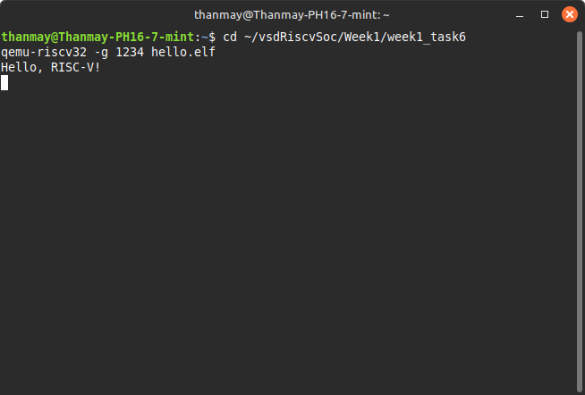
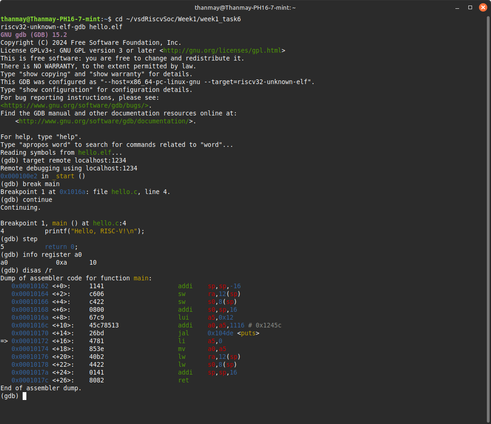

# Week 1 - Task 6: Stepping with GDB

## Objective

Debug a RISC-V ELF binary (`hello.elf`) using GDB:

- View register contents
- Disassemble instructions
- Step through the program using QEMU's GDB remote interface

---

## Method

### Step 1: Launch QEMU with GDB Server

```bash
qemu-riscv32 -g 1234 hello.elf
```

- Launches QEMU and halts execution
- Enables a GDB server on port 1234, waiting for a debugger to connect

---

### Step 2: Launch GDB in another terminal

```bash
riscv32-unknown-elf-gdb hello.elf
```

- Starts the RISC-V version of GDB and loads the ELF with symbols

---

### Step 3: Connect GDB to QEMU

```gdb
target remote localhost:1234
```

- Establishes connection with QEMU

---

### Step 4: View all available functions

```gdb
info functions
```

---

### Step 5: Set breakpoints and run

```gdb
break _start
continue

break main
continue

break exit
continue
```

---

### Step 6: Step Through and Inspect

```gdb
step
info reg a0
disas /r
```

---

## Learnings

✅ Cross-compilation for RISC-V  
✅ ELF generation with correct architecture  
✅ QEMU emulation  
✅ Remote debugging with GDB  
✅ Proper program execution flow  
✅ `Hello, RISC-V!` printed in QEMU  

---

## Screenshots

### Terminal 1 - QEMU Running

_Attach screenshot here:_  


---

### Terminal 2 - GDB Debugging Session

_Attach screenshot here:_  


---
