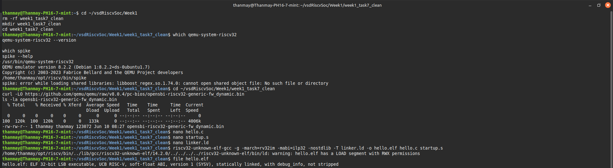
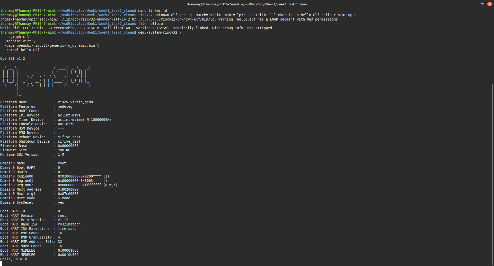

# 🖥️ Week 1 - Task 7: Boot Bare-Metal ELF & Show UART Output

## 🎯 Objective

Boot a bare-metal RISC-V ELF binary on QEMU and display UART output on the terminal.

## 🚀 Overview

In this task, we use QEMU to boot a bare-metal RISC-V ELF and print "Hello, RISC-V!" to the UART console. We faced several challenges in making this work correctly, especially regarding memory overlaps and UART configuration.

## 🧱 Setup Steps

### ✅ Step 1: Install Required Tools

```bash
sudo apt update
sudo apt install qemu-system-misc opensbi curl
```

### ✅ Step 2: Download OpenSBI Firmware

```bash
curl -LO https://github.com/qemu/qemu/raw/v8.0.4/pc-bios/opensbi-riscv32-generic-fw_dynamic.bin
ls -la opensbi-riscv32-generic-fw_dynamic.bin
```

### ✅ Step 3: Create Files

#### hello.c

```c
volatile char *uart = (char *)0x10000000;

void main() {
    const char *msg = "Hello, RISC-V!\n";
    while (*msg) {
        *uart = *msg++;
    }
    while (1);
}
```

#### startup.s

```asm
.section .text
.global _start

_start:
    la sp, stack_top     # Set up stack pointer
    call main            # Call main()
    j .                  # Infinite loop

.section .bss
.space 4096
stack_top:
```

#### linker.ld

```ld
ENTRY(_start)

MEMORY {
  RAM (rwx) : ORIGIN = 0x80200000, LENGTH = 128K
}

SECTIONS {
  .text : {
    *(.text*)
    *(.rodata*)
  } > RAM

  .data : {
    *(.data*)
  } > RAM

  .bss : {
    *(.bss*)
    *(COMMON)
  } > RAM
}
```

### ✅ Step 4: Compile the ELF

```bash
riscv32-unknown-elf-gcc -g -march=rv32im -mabi=ilp32 -nostdlib -T linker.ld -o hello.elf hello.c startup.s
file hello.elf
```

### ✅ Step 5: Run with QEMU

```bash
qemu-system-riscv32   -nographic   -machine virt   -bios opensbi-riscv32-generic-fw_dynamic.bin   -kernel hello.elf
```

## 🪛 Issues Faced and Fixes

### ❌ Issue 1: No UART Output Initially

- Initially, when running the ELF with QEMU, only the OpenSBI boot message appeared.
- The expected "Hello, RISC-V!" UART message was missing.

### 🔍 Investigation

- Verified that `hello.c` was writing to `0x10000000`, which matches the QEMU virt UART8250 device.
- Verified linker script used `0x80200000` to avoid memory overlap with OpenSBI.
- Checked `startup.s` to ensure the stack pointer and main() were set correctly.

### 🛠️ Fixes Applied

- Initially, I used a previous version of `hello_uart.c` with `stdio.h` and `putchar` which conflicted with built-in functions.
- Replaced it with a clean version of `hello.c` directly writing to UART, without using `stdio.h`.
- Verified that QEMU machine `virt` and memory mapping were correct.
- Recompiled everything with proper linker, startup, and C files.

### ✅ Final Outcome

- After applying the fixes and using a simple `hello.c`, QEMU showed both:
  - OpenSBI boot message
  - **Hello, RISC-V!** message from the UART

## ✅ Final Result

- OpenSBI boot message seen.
- `Hello, RISC-V!` UART output correctly displayed on terminal.

## 📸 Screenshots

### Screenshot 1: Successful QEMU Run



### Screenshot 2: ELF Compile Verification



---

**Task 7 Completed Successfully ✅**
