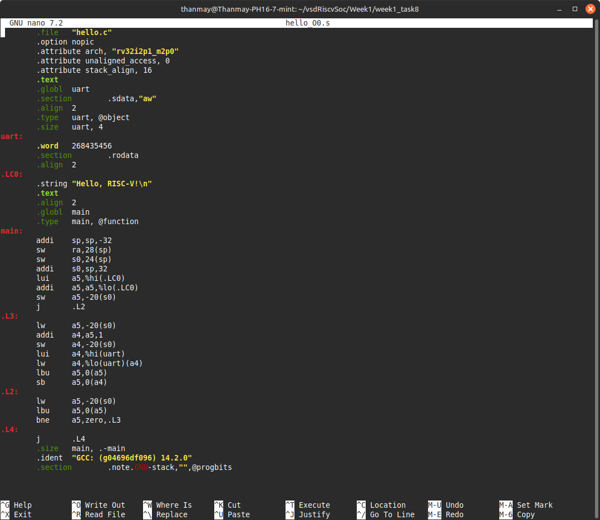
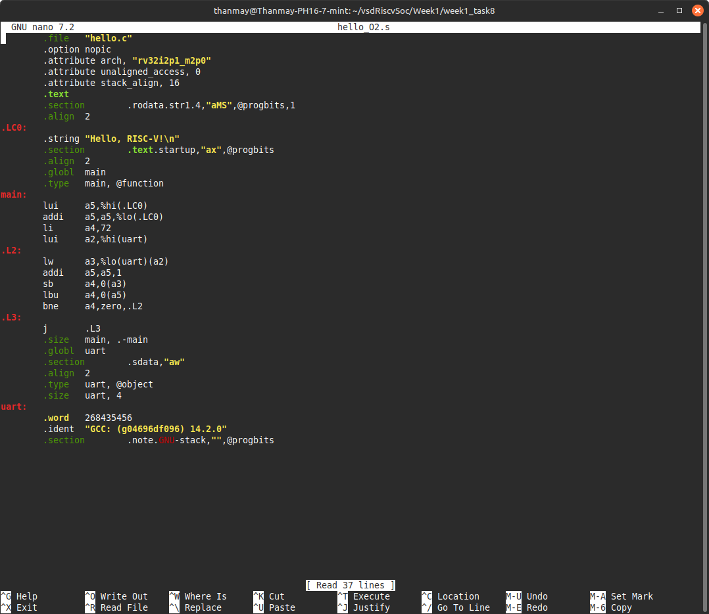

# 🚀 Week 1 - Task 8: Exploring GCC Optimization

## 🎯 Objective

Understand how GCC optimizations (-O0 vs -O2) affect generated assembly code.

## 📝 Task Description

We compiled the same `hello.c` program twice:

- With **no optimization** (`-O0`)
- With **optimization level 2** (`-O2`)

Then we compared the resulting `.s` (assembly) files to understand:

- Dead-code elimination
- Register allocation
- Inlining
- Other optimizations

## 🧱 Setup Steps

### ✅ Step 1: Folder Structure

```bash
cd ~/vsdRiscvSoc/Week1
mkdir week1_task8
cd week1_task8
```

### ✅ Step 2: Copy hello.c

```bash
cp ../week1_task7_clean/hello.c .
```

### ✅ Step 3: Compile with -O0

```bash
riscv32-unknown-elf-gcc -S -O0 -march=rv32im -mabi=ilp32 -o hello_O0.s hello.c
```

### ✅ Step 4: Compile with -O2

```bash
riscv32-unknown-elf-gcc -S -O2 -march=rv32im -mabi=ilp32 -o hello_O2.s hello.c
```

## 📸 Screenshots

### Screenshot 1: Assembly with -O0



### Screenshot 2: Assembly with -O2



## 🔍 Observed Differences & Explanations

### 1️⃣ Function Prologue / Epilogue Removal

**-O0**:

```asm
addi	sp,sp,-32
sw	ra,28(sp)
sw	s0,24(sp)
addi	s0,sp,32
```

- Sets up a stack frame → used for debugging and function call traceability.
- Slower, more memory used.

**-O2**:

- This prologue is **removed** because the function is small → stack frame not needed.
- Saves both time and code size.

### 2️⃣ Register Allocation

**-O0**:

```asm
lui	a5,%hi(.LC0)
addi	a5,a5,%lo(.LC0)
sw	a5,-20(s0)
```

- Stores the message pointer in memory → every loop iteration reloads from memory.

**-O2**:

```asm
lui	a5,%hi(.LC0)
addi	a5,a5,%lo(.LC0)
```

- Keeps the message pointer **entirely in register a5** → no memory overhead.

👉 This is **register allocation optimization** → speeds up execution.

### 3️⃣ Loop Simplification

**-O0**:

```asm
lw	a5,-20(s0)
addi	a4,a5,1
sw	a4,-20(s0)
```

**-O2**:

```asm
addi	a5,a5,1
```

- **Loop body** is simplified → fewer memory accesses.
- **Increment happens directly in register**, avoiding unnecessary loads/stores.

### 4️⃣ Dead-Code Elimination

- In this small example, there was no extra dead code to eliminate, so the `.text` section remained consistent in terms of active code.
- In larger programs, GCC -O2 would automatically **remove unused variables, functions, and loops** that do not affect observable output.

### 5️⃣ Inlining

- In this example, there were **no function calls eligible for inlining** (only `main()` present).
- In larger programs, **-O2** will inline small functions automatically.

## Summary of Key GCC Optimizations

| Optimization Type        | Example Seen |
|-------------------------|--------------|
| Prologue/Epilogue Removal | ✅ Yes |
| Register Allocation      | ✅ Yes |
| Loop Simplification      | ✅ Yes |
| Dead Code Elimination    | ⚠️ Minimal impact here (small program) |
| Inlining                 | ❌ Not applicable here |

## ✅ Final Result

- We confirmed that GCC -O2 produces **more efficient, smaller, and faster assembly** by:

  - Eliminating unnecessary stack setup.
  - Using registers instead of memory for variables.
  - Simplifying loops.
  - Preparing for dead-code elimination and inlining (though not visible in this tiny example).

**Task 8 Completed Successfully ✅**

---

