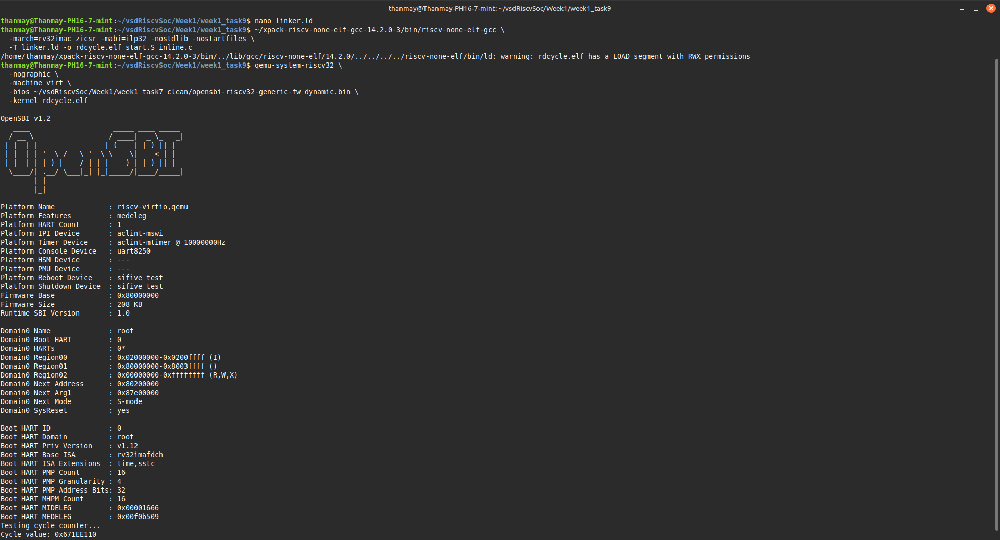

# 🧠 Week 1 - Task 9: Inline Assembly Basics

## 🎯 Objective
Implement a C function to read the RISC-V cycle counter using inline assembly and demonstrate UART output on QEMU.

---

## 🧪 Setup Overview

- ✅ Toolchain: `xpack-riscv-none-elf-gcc 14.2.0`
- ✅ Emulator: `qemu-system-riscv32`
- ✅ Output: Read CSR 0xC00 (cycle counter) and print it using UART on QEMU

---

## 📁 Directory Structure

```
week1_task9/
├── inline.c          # Main program with rdcycle() and UART printing
├── start.S           # Startup assembly to initialize stack and call main()
├── linker.ld         # Linker script for bare-metal RISC-V memory layout
└── rdcycle.elf       # Final compiled ELF executable
```

---

## 🚀 Step-by-Step Instructions

### ✅ Step 1: Create Required Files

#### `inline.c`

```c
#include <stdint.h>

#define UART_BASE 0x10000000

static inline uint32_t rdcycle(void) {
    uint32_t c;
    asm volatile ("csrr %0, 0xC00" : "=r"(c));
    return c;
}

void uart_putc(char c) {
    volatile uint8_t *uart = (volatile uint8_t *)UART_BASE;
    *uart = c;
}

void uart_puts(const char *str) {
    while (*str) uart_putc(*str++);
}

void uart_puthex(uint32_t value) {
    char hex[] = "0123456789ABCDEF";
    uart_puts("0x");
    for (int i = 28; i >= 0; i -= 4)
        uart_putc(hex[(value >> i) & 0xF]);
}

int main(void) {
    uart_puts("Testing cycle counter...\n");
    uint32_t val = rdcycle();
    uart_puts("Cycle value: ");
    uart_puthex(val);
    uart_putc('\n');
    return 0;
}
```

#### `start.S`

```asm
.section .text
.globl _start

_start:
    la sp, _stack_top
    call main
1:
    wfi
    j 1b

.section .bss
.space 4096
_stack_top:
```

#### `linker.ld`

```ld
ENTRY(_start)

MEMORY {
  RAM (rwx) : ORIGIN = 0x80200000, LENGTH = 128K
}

SECTIONS {
  .text : { *(.text*) *(.rodata*) } > RAM
  .data : { *(.data*) } > RAM
  .bss  : { *(.bss*) *(COMMON) } > RAM
}
```

---

## ⚙️ Step 2: Compile

```bash
~/xpack-riscv-none-elf-gcc-14.2.0-3/bin/riscv-none-elf-gcc \
  -march=rv32imac_zicsr -mabi=ilp32 -nostdlib -nostartfiles \
  -T linker.ld -o rdcycle.elf start.S inline.c
```

---

## 💻 Step 3: Run with QEMU

```bash
qemu-system-riscv32 \
  -nographic \
  -machine virt \
  -bios ../week1_task7_clean/opensbi-riscv32-generic-fw_dynamic.bin \
  -kernel rdcycle.elf
```

### 📸 Screenshot: Terminal Output

> Replace with your actual screenshot of UART output.
>
> 

---

## 🧵 Explanation of Inline Assembly

```c
asm volatile ("csrr %0, 0xC00" : "=r"(c));
```

- **`asm`**: GCC keyword for inline assembly
- **`volatile`**: Prevents the compiler from optimizing this instruction
- **`csrr`**: RISC-V instruction to read Control and Status Register
- **`%0`**: Output placeholder
- **`=r`**: Tells compiler to place result in a general-purpose register
- **`c`**: C variable where result will be stored

---

## ✅ Success Criteria

- [x] Program compiled using `riscv-none-elf-gcc`
- [x] Inline assembly for `rdcycle` used successfully
- [x] Program runs on QEMU with OpenSBI
- [x] UART output displays cycle counter

---

## 📚 Learning Outcomes

- ✅ CSR register access in RISC-V
- ✅ Basics of GCC inline assembly
- ✅ Understanding constraint syntax (`=r`, `r`)
- ✅ Bare-metal RISC-V development using QEMU
